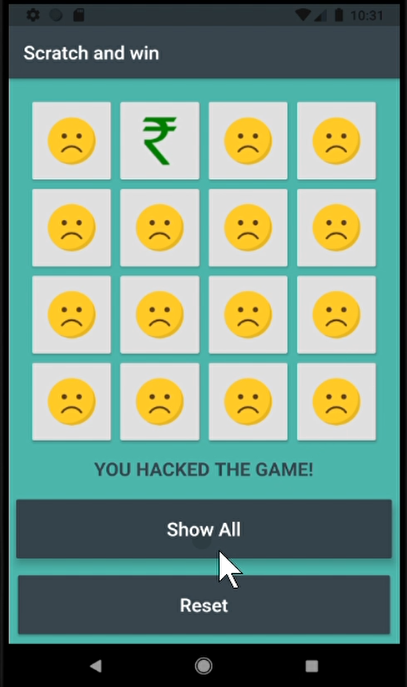

# scratchandwin

A new Flutter project GAME

## Getting Started
This App has a Game called Scratch and win where you have 16 possible buttons and 6 possible moves,
In these 6 moves you if you found the rupee you won the game and if you don't find it then you
looses the game or Game Drawn.
In this game you have given two buutons called Reset game and Show all
if you hit the reset button then game would strt again.
if you hit the show all button then it automatically shows you where the ruppe is present.

## screenshot

## What topics i learnt after this
I learnt about Image Assets, Row Widget, Column widget, Sized Button widget and most important i learnt is Grid Widget.

## How to use it?
Clone the repo , open it in Android Studio and try it out in your Physical Device or Emulator.

## How to contribute?
Fork the repo , make changes and give a valid Pull Request.
 

Thank You

A few resources to get you started if this is your first Flutter project:

- [Lab: Write your first Flutter app](https://flutter.dev/docs/get-started/codelab)
- [Cookbook: Useful Flutter samples](https://flutter.dev/docs/cookbook)

For help getting started with Flutter, view our
[online documentation](https://flutter.dev/docs), which offers tutorials,
samples, guidance on mobile development, and a full API reference.
